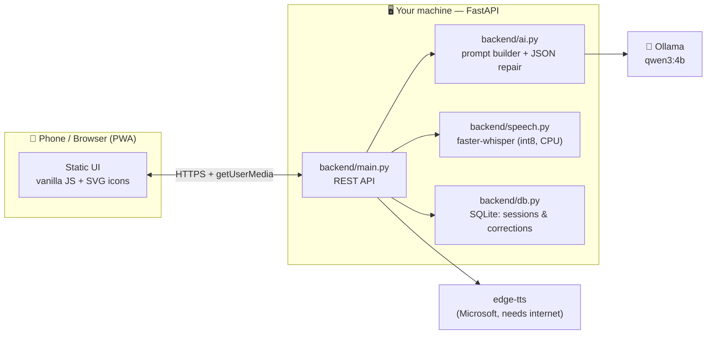

# Nova — Local Voice & Text Language Tutor

Practice **English, Portuguese, French, German, Italian** by voice *or* text with an ai tutor that runs
100% on your own machine. nova keeps the conversation going, corrects your mistakes
in real time (with explanations in spanish), and never sends your data anywhere.


## Why Nova?

| | |
|---|---|
| 🎙️ **Immersive voice mode** | Talk naturally; a VAD detects when you finish and auto-sends. Whisper (local) transcribes, edge-tts answers. |
| ⌨️ **Text mode** | Practice writing without a microphone. Corrections appear as persistent cards. |
| 📝 **Real-time corrections** | Every mistake becomes a card: what you said → what's right → the rule, explained in Spanish. |
| 🎯 **20 topics, always fresh** | Random topic picker that avoids repeating your recent sessions. |
| 🌓 **Dual theme** | Automatic light/dark (with manual override), glassmorphism UI, Lucide-style SVG icons. |
| 🔒 **Fully local** | LLM (Ollama) and speech-to-text (faster-whisper) run on your hardware. |

## Architecture



- **Backend**: FastAPI, Pydantic-validated payloads, typed errors (`503` model down,
  `502` malformed model output), Whisper runs in a threadpool so the event loop never blocks.
- **Frontend**: dependency-free vanilla JS, inline SVG icon system, WCAG 2.2 AA
  (keyboard-operable orb, live regions, reduced-motion support, 4.5:1+ contrast).

## Quickstart (one command)

Requirements: Linux (Debian/Ubuntu for the auto-installer), `curl` and internet for the first setup.

```bash
bash install.sh
```

That's it. The installer prepares everything (Ollama, AI model, dependencies) and puts a
**"Nova Tutor" icon on your desktop**. Double-click it, scan the QR with your phone and start practicing.

### Low-end PCs (8 GB RAM, no GPU)

Nova **auto-detects your hardware**: with less than 10 GB of RAM it switches to a smaller
LLM (`qwen3:1.7b`), a lighter Whisper (`base`) and shorter replies, so a 2015 i5 with 8 GB
runs it comfortably. Force it with `NOVA_PROFILE=low` or `NOVA_PROFILE=high`.

<details>
<summary><b>Manual setup</b> (if you prefer)</summary>

Requirements: Linux/macOS, Python 3.10+, [Ollama](https://ollama.com), `ffmpeg`.

```bash
ollama pull qwen3:4b          # or qwen3:1.7b on 8 GB machines
python3 -m venv .venv
.venv/bin/pip install -r requirements.txt
./run.sh start                # QR code included
./run.sh status | stop | restart
```
</details>

Open `http://<your-lan-ip>:8000` — for microphone access use the HTTPS URL printed
by `run.sh` (browsers only grant `getUserMedia` on secure contexts).

<details>
<summary><b>Docker</b> (no local Python needed)</summary>

```bash
docker compose up --build
# app on :8000, Ollama on :11434 — pull the model once:
docker compose exec ollama ollama pull qwen3:4b
```
</details>

### Configuration

Copy `.env.example` to `.env` (or export the vars). Highlights:

| Variable | Default | Purpose |
|---|---|---|
| `NOVA_OLLAMA_MODEL` | `qwen3:4b` | Any Ollama chat model |
| `NOVA_WHISPER_MODEL` | `small` | tiny/base/small/medium/large-v3 |
| `NOVA_PUBLIC_HOSTNAME` | *(empty)* | Public HTTPS host used for the HTTP→HTTPS redirect |

## Development

```bash
make test    # pytest with coverage gate (fail-under 95)
make lint    # ruff + mypy
make dev     # uvicorn --reload
```

## HTTPS for the microphone

`getUserMedia` requires a secure context. Options:

1. **Tailscale + MagicDNS certs** (current setup): `tailscale cert` → mount in `certs/`.
2. **Caddy** reverse proxy with your own domain.
3. **cloudflared** tunnel (free, no port forwarding).

## Project layout

```
backend/
  main.py      # FastAPI app, endpoints, error handling
  ai.py        # Ollama client, prompts, JSON repair, topic picker
  schemas.py   # Pydantic request models
  speech.py    # Whisper transcription + pronunciation scoring
  tts.py       # edge-tts synthesis
  db.py        # SQLite persistence (sessions, corrections, stats)
  config.py    # Environment-based settings
  tests/       # 98 tests, no network required
frontend/      # SPA Svelte 5 + Vite (npm run build → dist/ servido por FastAPI)
  src/         # componentes, stores y estilos (app.css)
  dist/        # build de producción (generado, no se sube)
run.sh         # start/stop/status with QR code
```

## License

[MIT](LICENSE) · Icons: [Lucide](https://lucide.dev) (ISC)
