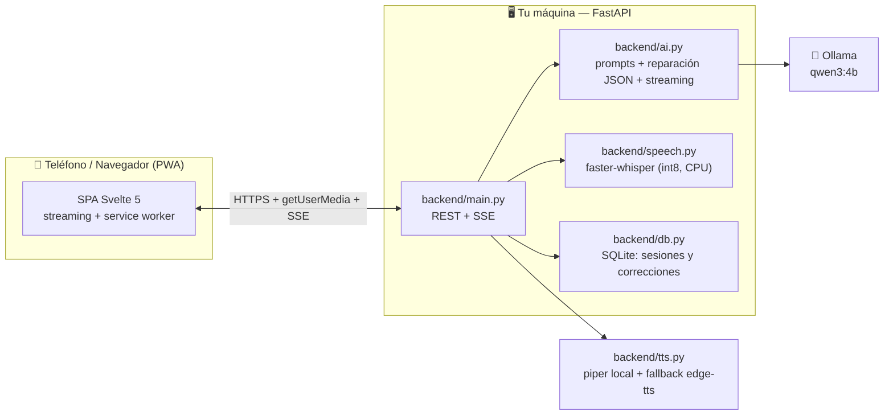

# Nova — Local Voice & Text Language Tutor

Practice **English, Portuguese, French, German, Italian** by voice *or* text with an ai tutor that runs
100% on your own machine. nova keeps the conversation going, corrects your mistakes
in real time (with explanations in spanish), and never sends your data anywhere.


## Why Nova?

| | |
|---|---|
| 🎙️ **Inmersivo por voz** | Habla natural; el VAD detecta cuando terminas y envía solo. Whisper (local) transcribe, piper (local) responde sin gastar internet. |
| ⌨️ **Modo texto** | Practica escrita sin micrófono. Correcciones persistentes como tarjetas. |
| ⚡ **Respuestas en streaming** | Nova escribe mientras piensa y **habla frase a frase** en cuanto se completa, sin esperar a terminar. |
| 📝 **Correcciones en vivo** | Cada fallo se convierte en tarjeta: qué dijiste → cómo es → la regla, explicada en español. |
| ✍️ **Corrector de textos** | Pega o escribe una frase suelta y Nova la corrige y explica, sin iniciar conversación. |
| 🎯 **20 temas, siempre frescos** | Selector aleatorio que evita repetir tus últimas sesiones. |
| 🌓 **Tema dual** | Claro/oscuro automático (con override), glassmorphism, iconos SVG estilo Lucide. |
| 📲 **PWA instalable** | Añádela al menú del teléfono; el service worker da shell offline tras la primera visita. |
| 🔒 **100% local** | LLM (Ollama), speech-to-text (faster-whisper) y castellano TTS (piper) corren en tu máquina. |

## Architecture



- **Backend**: FastAPI, payloads validados con Pydantic, errores tipados (`503` modelo caído,
  `502` salida malformada), respuestas de Nova por **SSE en streaming** y Whisper en un
  threadpool para no bloquear el event loop.
- **Frontend**: SPA en **Svelte 5** (runes) + Vite, iconos SVG propios, WCAG 2.2 AA
  (skip link, foco visible, focus trap en diálogos, live regions, reduced-motion, 4.5:1+ contraste).
- **TTS**: por defecto **piper** (local, solo CPU, descarga la voz a la primera) con caída a
  edge-tts si no hay voz instalada ni internet (`NOVA_TTS_BACKEND=piper`).

## Quickstart (one command)

Requirements: Linux (Debian/Ubuntu for the auto-installer), `curl` and internet for the first setup.

```bash
bash install.sh
```

That's it. The installer prepares everything (Ollama, AI model, dependencies) and puts a
**"Nova Tutor" icon on your desktop**. Double-click it, scan the QR with your phone and start practicing.

### Low-end PCs (8 GB RAM, no GPU)

Nova **auto-detects your hardware**: with less than 10 GB of RAM it switches to a smaller
LLM (`qwen3:1.7b`), a lighter Whisper (`base`) and shorter replies, so a 2015 i5 with 8 GB
runs it comfortably. Force it with `NOVA_PROFILE=low` or `NOVA_PROFILE=high`.

<details>
<summary><b>Manual setup</b> (if you prefer)</summary>

Requirements: Linux/macOS, Python 3.10+, [Ollama](https://ollama.com), `ffmpeg`.

```bash
ollama pull qwen3:4b          # or qwen3:1.7b on 8 GB machines
python3 -m venv .venv
.venv/bin/pip install -r requirements.txt
./run.sh start                # QR code included
./run.sh status | stop | restart
```
</details>

Open `http://<your-lan-ip>:8000` — for microphone access use the HTTPS URL printed
by `run.sh` (browsers only grant `getUserMedia` on secure contexts).

<details>
<summary><b>Docker</b> (no local Python needed)</summary>

```bash
docker compose up --build
# app on :8000, Ollama on :11434 — pull the model once:
docker compose exec ollama ollama pull qwen3:4b
```
</details>

### Configuration

Copy `.env.example` to `.env` (or export the vars). Highlights:

| Variable | Default | Purpose |
|---|---|---|
| `NOVA_OLLAMA_MODEL` | `qwen3:4b` | Any Ollama chat model |
| `NOVA_WHISPER_MODEL` | `small` | tiny/base/small/medium/large-v3 |
| `NOVA_TTS_BACKEND` | `edge` | `piper` = voz local (solo CPU) o `edge` (necesita red) |
| `NOVA_PIPER_HOME` | `~/.local/share/nova/piper` | Where piper caches voice models |
| `NOVA_PUBLIC_HOSTNAME` | *(empty)* | Public HTTPS host used for the HTTP→HTTPS redirect |

## Development

```bash
make test    # pytest with coverage gate (fail-under 95)
make lint    # ruff + mypy
make dev     # uvicorn --reload
```

## Trucos

- **Corregir un texto suelto**: bajo la conversación está el botón *Corregir texto* — escribe (o pega)
  una frase y Nova la corrige y explica, sin iniciar una sesión.
- **Cortar mientras Nova habla**: el TTS va **por frases** en streaming: si tocas el orbe durante su
  respuesta la interrumpes y empiezas a hablar tú (aunque a veces querrás esperar a que termine).
- **Instalar como app (PWA)**: en el navegador del teléfono, menú → *Añadir a pantalla de inicio*.
  Tras la primera visita el service worker permite abrir Nova sin conexión (voz y LLM seguirán
  necesitando el servidor).

## HTTPS for the microphone

`getUserMedia` requires a secure context. Options:

1. **Tailscale + MagicDNS certs** (current setup): `tailscale cert` → mount in `certs/`.
2. **Caddy** reverse proxy with your own domain.
3. **cloudflared** tunnel (free, no port forwarding).

## Project layout

```
backend/
  main.py      # FastAPI app, endpoints, SSE streaming, error handling
  ai.py        # Ollama client, prompts, JSON repair, topic picker
  schemas.py   # Pydantic request models
  speech.py    # Whisper transcription + pronunciation scoring
  tts.py       # piper (local) + edge-tts fallback synthesis
  db.py        # SQLite persistence (sessions, corrections, stats)
  config.py    # Environment-based settings
  tests/       # 205 tests, no network required
frontend/      # SPA Svelte 5 + Vite (npm run build → dist/ served by FastAPI)
  src/         # components, stores and styles (app.css)
  public/      # PWA: manifest, icons, service worker (sw.js)
  dist/        # production build (generated, not committed)
run.sh         # start/stop/status with QR code
```

## License

[MIT](LICENSE) · Icons: [Lucide](https://lucide.dev) (ISC)
