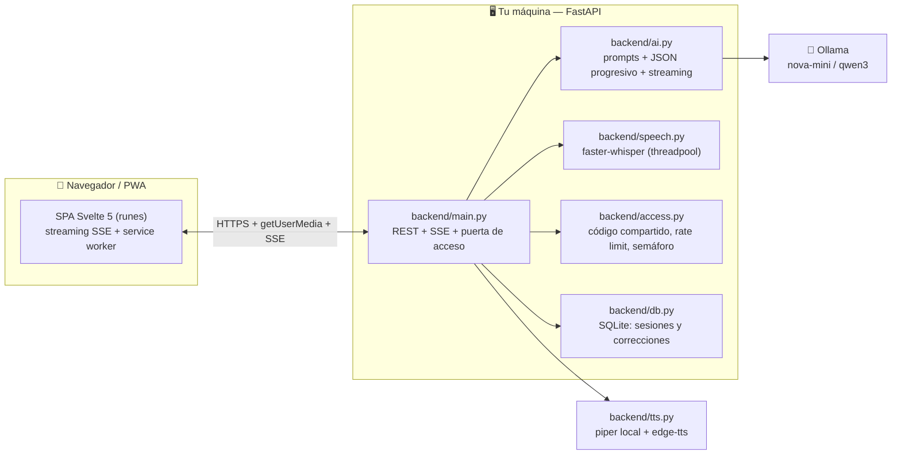

# PracticeSpeak AI

> 🎓 **Practica idiomas hablando.** Un tutor de idiomas con IA que corre 100% en tu propia
> máquina: habla o escribe en inglés, portugués, francés, alemán, italiano, español, ruso o
> chino, y recibe correcciones en tiempo real explicadas en español.


---

## ¿Por qué te va a gustar?

| | |
|---|---|
| 🎙️ **Inmersivo por voz** | Habla natural; el sistema detecta cuando terminas y envía solo. Whisper (local) transcribe y la voz responde frase a frase. |
| ⚡ **Interrumpe cuando quieras** | Habla por encima (o toca el orbe) para cortar al tutor a mitad de frase, como en una conversación real. |
| 📝 **Correcciones en vivo** | Cada fallo se convierte en una tarjeta: qué dijiste → cómo se dice → la regla, explicada en español. |
| ⌨️ **Modo texto** | ¿Sin micrófono? Practica escrita con el mismo sistema de correcciones. |
| ✍️ **Corrector suelto** | Pega una frase y recibe la corrección explicada, sin iniciar una sesión. |
| 🎯 **20 temas siempre frescos** | Viajes, comida, trabajo, cine… el selector evita repetir tus últimas sesiones. |
| 📲 **PWA instalable** | Añádela a la pantalla de inicio del móvil; funciona como una app nativa. |
| 🔒 **Privado por diseño** | El LLM (Ollama) y el reconocimiento de voz (faster-whisper) corren en tu hardware. Tus conversaciones no salen de tu servidor. |

**Idiomas disponibles**: inglés, portugués, francés, alemán, italiano, español, ruso y chino (mandarín).

---

## Para quien solo quiere probarlo

1. **Si un amigo te invitó a su servidor**: abre la URL que te pasó, escribe el **código de
   acceso** y empieza a practicar. No necesitas instalar nada ni crear cuenta — solo un
   apodo para guardar tu progreso. Desde el navegador puedes instalarla como app
   (*Añadir a pantalla de inicio*).
2. **Si quieres tu propio servidor**: sigue el Quickstart de abajo. Un PC normal con
   Linux y 8 GB de RAM sobra.

## Quickstart (un comando)

Requisitos: Linux (el instalador automático es para Debian/Ubuntu), `curl` e internet
solo la primera vez.

```bash
bash install.sh
```

El instalador prepara todo (Ollama, modelo de IA, dependencias) y crea un icono
**"PracticeSpeak AI"** en tu escritorio. Doble clic, escanea el QR con el móvil y a practicar.

<details>
<summary><b>Instalación manual</b></summary>

Requisitos: Linux/macOS, Python 3.10+, [Ollama](https://ollama.com), `ffmpeg`, Node 22+.

```bash
ollama pull qwen3:1.7b          # o qwen3:4b en máquinas con GPU grande
python3 -m venv .venv
.venv/bin/pip install -r requirements.txt
(cd frontend && npm ci && npm run build)
./run.sh start                  # QR incluido
./run.sh status | stop | restart
```
</details>

<details>
<summary><b>Con Docker</b></summary>

```bash
docker compose up --build
docker compose exec ollama ollama pull qwen3:1.7b   # el modelo, una sola vez
```
</details>

### Rendimiento según tu hardware

PracticeSpeak AI **autodetecta la RAM** de tu máquina y elige perfil:

| Perfil | Cuándo | LLM | Whisper |
|---|---|---|---|
| `low` | < 10 GB RAM | `qwen3:1.7b` | `base` |
| `high` | ≥ 10 GB RAM | `qwen3:4b` | `small` |

Fuerza uno con `NOVA_PROFILE=low|high`. En una **GTX 1650 SUPER (4 GB)** el modelo ligero
corre 100% en GPU: respuestas completas en ~0.4 s (TTFT < 35 ms). La guía para ajustar
modelos a tu GPU está en [Modelos de IA](#modelos-de-ia).

---

## Compartir PracticeSpeak con amigos (URL pública)

Sin abrir puertos del router, con HTTPS y una URL fija:

```bash
./run.sh start          # arranca la app + Ollama
./run.sh funnel on      # publica https://<tu-host>.ts.net (Tailscale Funnel)
./run.sh funnel off     # cierra el acceso cuando quieras
```

Requisitos únicos: [Tailscale](https://tailscale.com) instalado y los toggles **HTTPS** y
**Funnel** activados en la [consola de administración](https://login.tailscale.com/admin/funnel)
(una sola vez).

Comparte la **URL** y el **código de acceso** por un canal privado. El código se define en `.env`:

```ini
NOVA_ACCESS_CODE=mi-codigo       # si está vacío, el servidor no pide código
```

Cuando hay código, toda la API lo exige (pantalla de acceso en el navegador, cabecera
`X-Nova-Code` o `?code=` en la URL). `/api/health` queda abierta para poder comprobar el
estado. Además, dos protecciones anti-abuso vienen configuradas:

```ini
NOVA_MAX_CONCURRENT_STREAMS=2    # conversaciones simultáneas (protege la CPU/GPU)
NOVA_RATE_LIMIT_PER_MINUTE=30    # peticiones por IP y minuto en endpoints caros
```

> **Tus datos sobreviven a los reinicios**: la base SQLite vive en
> `~/.local/share/nova/nova.db` (configurable con `NOVA_DATA_DIR` / `NOVA_DB_PATH`).

Alternativas al Funnel: **cloudflared** (túnel gratis con tu dominio) o **Caddy**
(proxy inverso con dominio y puertos abiertos).

---

## Para desarrolladores

### Arquitectura



**Decisiones de diseño que conviene conocer:**

- **Streaming de verdad**: `/api/immersive/stream` emite eventos SSE (`topic`, `delta`,
  `corrections`, `done`). El backend **parsea el JSON del LLM de forma progresiva**
  (`_json_field_progressive`) y emite el campo `reply` frase a frase conforme se genera;
  el frontend lo manda a sintetizar en cuanto hay una frase completa. Resultado: el
  usuario empieza a oír la respuesta antes de que el modelo termine de escribir.
- **Respuesta estructurada tolerante**: se pide JSON con `format: "json"` de Ollama y
  además hay reparación (`_clean_json`) para vallas de código, JSON incrustado en prosa,
  escapes Unicode parciales, etc.
- **El VAD decide cuándo enviar**: el frontend graba con Voice Activity Detection y envía
  el audio al soltar; soporta *barge-in* (interrumpir al tutor mientras habla).
- **Whisper en threadpool**: la transcripción es bloqueante y corre en un hilo aparte para
  no congelar el event loop con varios usuarios.
- **Puerta de acceso sin cuentas**: un código compartido en cabecera + `localStorage`.
  El service worker **nunca** intercepta `/api/*` (ni cachea la API), y el frontend no
  consulta perfiles hasta que la puerta está resuelta — así nadie ve un 401 falso.
- **Modelo con fallback**: `resolve_model()` comprueba en `/api/tags` que el modelo
  configurado exista; si falta, cae a `NOVA_OLLAMA_FALLBACK_MODEL` en vez de dar 503.

### Estructura del proyecto

```
backend/
  main.py        # FastAPI: endpoints, SSE, middlewares (código, caché, logs)
  ai.py          # Ollama: prompts, JSON progresivo, streaming, fallback de modelo
  schemas.py     # Modelos Pydantic de las peticiones
  speech.py      # Transcripción Whisper + puntuación de pronunciación
  tts.py         # Síntesis de voz: piper (local) + edge-tts (nube)
  access.py      # Código de acceso, rate limit por IP, semáforo de streams
  db.py          # SQLite (perfiles, sesiones, correcciones, export Anki)
  config.py      # Configuración por entorno + perfil de recursos autodetectado
  tests/         # 269 tests, sin red ni modelos reales
frontend/
  src/lib/       # api.ts, session.svelte.ts (orquestador), access, profile, settings
  src/lib/audio/ # grabador + VAD, reproducción con barge-in
  src/public/    # PWA: manifest, iconos, service worker
  dist/          # build de producción (servido por FastAPI en / y /static)
scripts/
  benchmark_models.py   # comparación de modelos con el payload real de la app
  modelfiles/           # Modelfiles de los modelos personalizados
run.sh           # start/stop/status + funnel on/off/status + QR
install.sh       # instalador de un comando
```

### Desarrollo

```bash
make dev          # uvicorn con recarga automática
make test         # pytest + gate de cobertura (mín. 95%)
make lint         # ruff + mypy
cd frontend && npm test      # vitest (52 tests)
cd frontend && npm run check # svelte-check + tsc
```

Convenciones: Python con tipado (mypy estricto en `backend/`), Svelte 5 con runes,
comentarios y UI en español, tests sin red (todo se parchea). El CI ejecuta pytest,
ruff, mypy, vitest, svelte-check, build y un chequeo anti-emojis/anti-secretos en la UI.

### API en un minuto

| Endpoint | Qué hace |
|---|---|
| `POST /api/immersive/stream` | Conversación inmersiva en SSE (start/continue). El corazón de la app. |
| `POST /api/immersive` | Igual, sin streaming (respuesta única). |
| `POST /api/chat` | Tutor por turnos simple. |
| `POST /api/grammar` | Corrección de un texto suelto. |
| `POST /api/audio` | Audio → transcripción + puntuación de pronunciación. |
| `GET /api/tts` | Texto → audio (piper local o edge-tts). |
| `GET /api/tts/voices` | Catálogo de voces por idioma. |
| `GET /api/profiles` · `GET /api/stats` · `GET /api/export/anki` | Perfiles, progreso y exportación de correcciones. |
| `GET /api/health` | Estado de Ollama, modelo y si el servidor pide código. |

Autenticación: si `NOVA_ACCESS_CODE` está definido, añade la cabecera `X-Nova-Code: <código>`
(o `?code=`) a cualquier llamada salvo `/api/health`.

### Modelos de IA

El proyecto funciona con cualquier modelo de chat de Ollama. Trae dos **modelos
personalizados** (`scripts/modelfiles/`) con los parámetros de generación de la app
horneados (temperatura 0.8, repeat_penalty 1.15, contexto 2048):

```bash
ollama create nova-mini -f scripts/modelfiles/nova-mini.Modelfile   # qwen3:1.7b — el más rápido
ollama create nova-3b   -f scripts/modelfiles/nova-3b.Modelfile     # llama3.2:3b — más capacidad
```

Cómo elegir (medido con `scripts/benchmark_models.py`, que usa el payload exacto de la app):

| Modelo | VRAM | TTFT | Respuesta completa | Recomendado para |
|---|---|---|---|---|
| **nova-mini** | ~2 GB (100% GPU en 4 GB) | ~30 ms | ~0.4 s | Voz fluida, GPUs modestas |
| nova-3b | ~2.7 GB | ~40 ms | 0.6–1.4 s | Un poco más de matiz |
| qwen3:4b | ~3.2 GB (se derrama a CPU en 4 GB) | ~60 ms | 1.7–2.2 s | GPUs de 8 GB+ |

Cambia el modelo con `NOVA_OLLAMA_MODEL` en `.env`. Para exprimir la GPU, activa en el
servidor de Ollama `OLLAMA_FLASH_ATTENTION=1` y `OLLAMA_KV_CACHE_TYPE=q8_0`.

> ¿Quieres un modelo afinado a tuMaterial propio? El flujo de *tuning* ligero con
> Modelfiles está pensado como punto de partida: ajusta los `PARAMETER`, crea tu variante
> con `ollama create` y médela con el benchmark antes de decidir.

### Configuración completa

| Variable | Default | Uso |
|---|---|---|
| `NOVA_ACCESS_CODE` | *(vacío)* | Código compartido para la puerta de acceso |
| `NOVA_MAX_CONCURRENT_STREAMS` | `2` | Conversaciones simultáneas (0 = sin límite) |
| `NOVA_RATE_LIMIT_PER_MINUTE` | `30` | Peticiones por IP/min en endpoints caros |
| `NOVA_OLLAMA_MODEL` | autodetectado | Cualquier modelo de chat de Ollama |
| `NOVA_OLLAMA_FALLBACK_MODEL` | `qwen3:1.7b` | Si el modelo configurado no existe |
| `NOVA_OLLAMA_BASE_URL` | `http://127.0.0.1:11434` | Servidor Ollama |
| `NOVA_WHISPER_MODEL` | autodetectado | `tiny`/`base`/`small`/`medium`/`large-v3` |
| `NOVA_TTS_BACKEND` | `edge` | `piper` = voz 100% local, `edge` = nube Microsoft |
| `NOVA_DATA_DIR` | `~/.local/share/nova` | Carpeta de datos persistentes |
| `NOVA_DB_PATH` | `$NOVA_DATA_DIR/nova.db` | Ruta concreta de la base SQLite |
| `NOVA_PROFILE` | autodetectado | `low` (PC modesto) / `high` |
| `NOVA_PUBLIC_HOSTNAME` | *(vacío)* | Host HTTPS para el aviso de redirección |
| `NOVA_HOST` / `NOVA_PORT` | `0.0.0.0` / `8000` | Escucha del servidor |

---

## Solución de problemas

| Síntoma | Causa probable | Solución |
|---|---|---|
| El micrófono no funciona | Contexto no seguro (HTTP) | Usa la URL HTTPS del funnel o `localhost` |
| `401 Unauthorized` al entrar | Código incorrecto o no enviado | Escribe el código que te pasó el anfitrión |
| El modelo tarda ~25 s la 1ª vez | Arranque en frío de Ollama | Normal: carga el modelo a VRAM (caduca a los 30 min sin uso) |
| "PracticeSpeak está ocupada" | Semáforo de streams lleno | Espera unos segundos; sube `NOVA_MAX_CONCURRENT_STREAMS` si tu GPU aguanta |
| La PWA muestra contenido viejo | Caché del service worker | Se resuelve sola al recargar; el SW se versiona con cada cambio |
| `model not found` en el log | Modelo personalizado sin crear | `ollama create nova-mini -f scripts/modelfiles/nova-mini.Modelfile` (o deja que el fallback actúe) |

## Contribuir

1. Haz fork y crea una rama: `git checkout -b mi-feature`
2. Asegúrate de que pasa: `make test && make lint && (cd frontend && npm test && npm run check)`
3. Mantén la cobertura ≥ 95% (el CI lo exige)
4. Pull request con una descripción clara del *porqué*

## License

[MIT](LICENSE) · Iconos: [Lucide](https://lucide.dev) (ISC)
